# WEEK 1

## QUERIES
create database Insurance;
use Insurance;

create table person (driver_id varchar(10),name varchar(20), address varchar(30), primary key(driver_id));

create table car(reg_num varchar(10),model varchar(10),year int, primary key(reg_num));

create table accident(report_num int, accident_date date, location varchar(20),primary key(report_num));

create table owns(driver_id varchar(10),reg_num varchar(10),primary key(driver_id, reg_num),
foreign key(driver_id) references person(driver_id),foreign key(reg_num) references car(reg_num));

create table participated(driver_id varchar(10), reg_num varchar(10),report_num int, damage_amount int,
primary key(driver_id, reg_num, report_num),foreign key(driver_id) references person(driver_id),
foreign key(reg_num) references car(reg_num),foreign key(report_num) references accident(report_num));

insert into person values
("A01","Richard","Srinivas nagar"),
("A02","Pradeep","Rajaji nagar"),
("A03","Smith","Ashok nagar"),
("A04","Venu","N R Colony"),
("A05","Jhon","Hanumanth nagar");

insert into car values
("KA052250","Indica",1990),
("KA031181","Lancer",1957),
("KA095477","Toyota",1998),
("KA053408","Honda",2008),
("KA041702","Audi",2005);

insert into owns values
("A01","KA052250"),
("A02","KA053408"),
("A03","KA031181"),
("A04","KA095477"),
("A05","KA041702");

insert into accident values
(11,"2003-01-01","Mysore Road"),
(12,"2004-02-02","South end Circle"),
(13,"2003-01-21","Bull temple Road"),
(14,"2008-02-17","Mysore Road"),
(15,"2005-03-04","Kanakpura Road");

insert into participated values
("A01","KA052250",11,10000),
("A02","KA053408",12,50000),
("A03","KA095477",13,25000),
("A04","KA031181",14,3000),
("A05","KA041702",15,5000);

select * from person;
select * from car;
select * from accident;
select * from owns;
select * from participated;

update participated set damage_amount=25000 where reg_num="KA053408" and report_num=12;
select * from participated;

select count(distinct driver_id) from participated a, accident b where a.report_num=b.report_num 
and b.accident_date like '2008%';

insert into accident values(16,"2008-03-08","Domlur");
select * from accident;

select accident_date,location from accident;

select driver_id from participated where damage_amount>=25000;

select * from car order by year asc;

select count(report_num) from car c,participated p where c.reg_num=p.reg_num and c.model="Lancer";

select count(distinct driver_id) from participated p,accident a where p.report_num=a.report_num 
and a.accident_date like "2008%";

select * from participated order by damage_amount desc;

select avg(damage_amount) from participated;

delete from participated where damage_amount<11500;

select name from person p,participated pt where p.driver_id=pt.driver_id and pt.damage_amount>11500;

select max(damage_amount) from participated;

## TABLES

<table>
1.
  <tr>
    <td style="border: 4px solid gray; border-radius: 8px;">
      
    </td>
  </tr>
</table>

<table>
  2.
  <tr>
    <td style="border: 4px solid gray; border-radius: 8px;">
      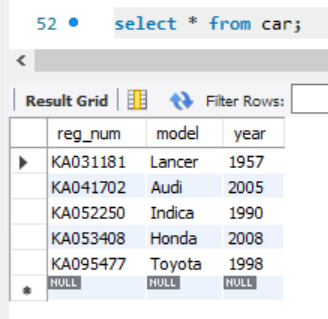
    </td>
  </tr>
</table>

<table>
  3.
  <tr>
    <td style="border: 4px solid gray; border-radius: 8px;">
      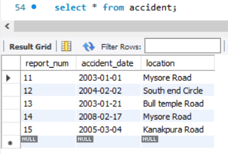
    </td>
  </tr>
</table>

<table>
  4.
  <tr>
    <td style="border: 4px solid gray; border-radius: 8px;">
      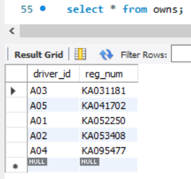
    </td>
  </tr>
</table>

<table>
  5.
  <tr>
    <td style="border: 4px solid gray; border-radius: 8px;">
      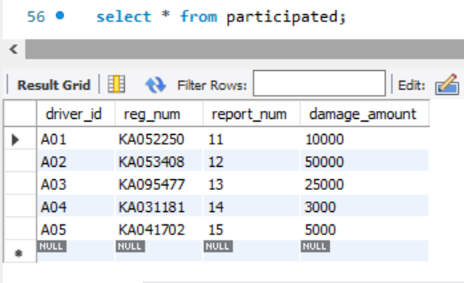
    </td>
  </tr>
</table>

## OUTPUT

<table>
  1.Update the damage amount to 25000 for the car with a specific reg-num
(example 'KA053408' ) for which the accident report number was 12.
    <tr>
    <td style="border: 4px solid gray; border-radius: 8px;">
      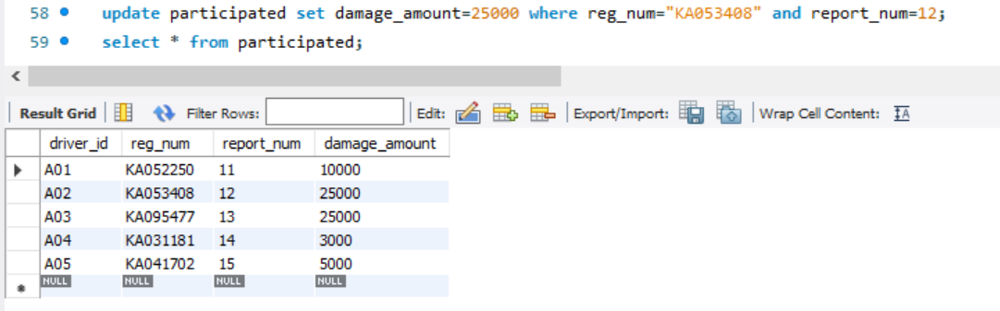
    </td>
  </tr>
</table>

<table>
  2.Find the total number of people who owned cars that were involved in accidents in 2008.
  <tr>
    <td style="border: 4px solid gray; border-radius: 8px;">
      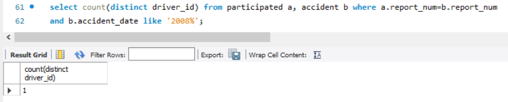
    </td>
  </tr>
</table>

<table>
  3.Add a new accident to the database.
  <tr>
    <td style="border: 4px solid gray; border-radius: 8px;">
      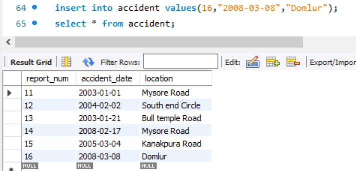
    </td>
  </tr>
</table>

<table>
  4.Display Accident date and location.
  <tr>
    <td style="border: 4px solid gray; border-radius: 8px;">
      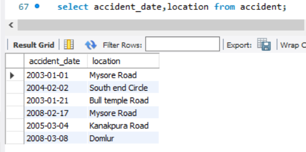
    </td>
  </tr>
</table>

<table>
  5.Display driver id who did accident with
damage amount greater than or equal to
Rs.25000.
  <tr>
    <td style="border: 4px solid gray; border-radius: 8px;">
      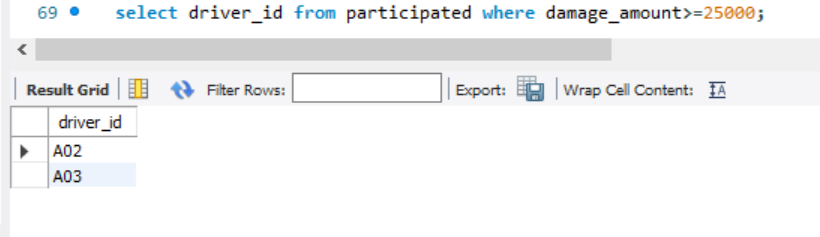
    </td>
  </tr>
</table>

<table>
  6.Display the entire CAR relation in the ascending order of manufacturing year.
damage amount greater than or equal to
Rs.25000.
  <tr>
    <td style="border: 4px solid gray; border-radius: 8px;">
      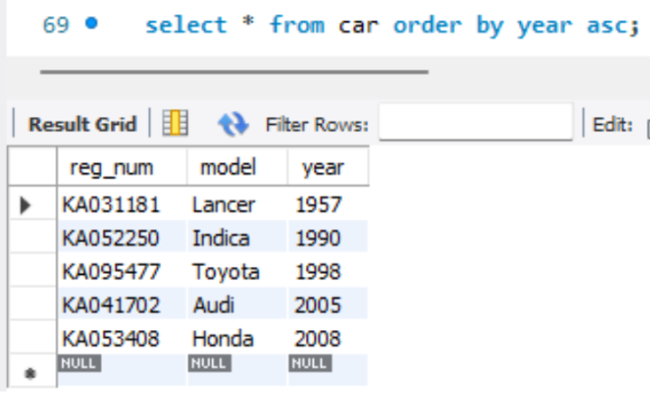
    </td>
  </tr>
</table>

<table>
  7.Find the number of accidents in which cars belonging to a specific model (example 'Lancer') were
involved.
  <tr>
    <td style="border: 4px solid gray; border-radius: 8px;">
      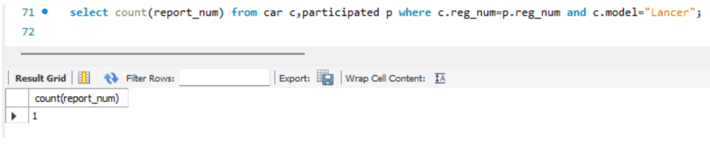
    </td>
  </tr>
</table>

<table>
  8.Find the total number of people who owned cars that involved in accidents in 2008.
  <tr>
    <td style="border: 4px solid gray; border-radius: 8px;">
      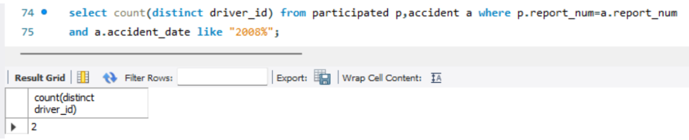
    </td>
  </tr>
</table>

<table>
  9.List the entire participated relation in the descending order of damage amount.
  <tr>
    <td style="border: 4px solid gray; border-radius: 8px;">
      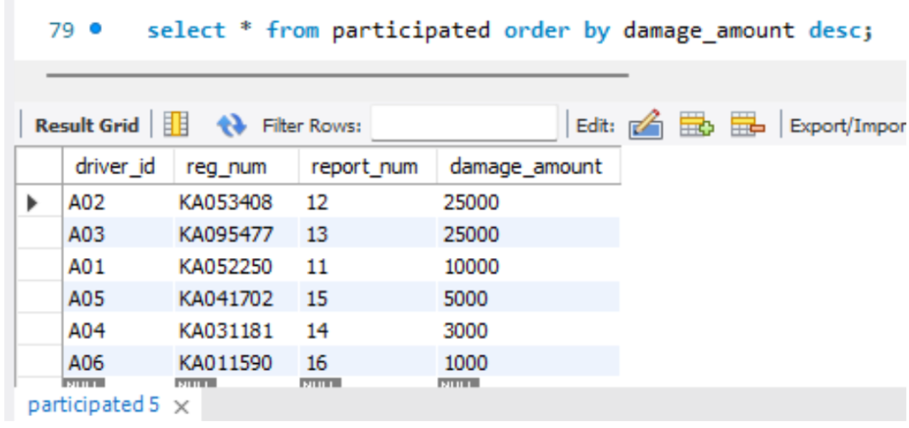
    </td>
  </tr>
</table>

<table>
  10.Find the average damage amount.
  <tr>
    <td style="border: 4px solid gray; border-radius: 8px;">
      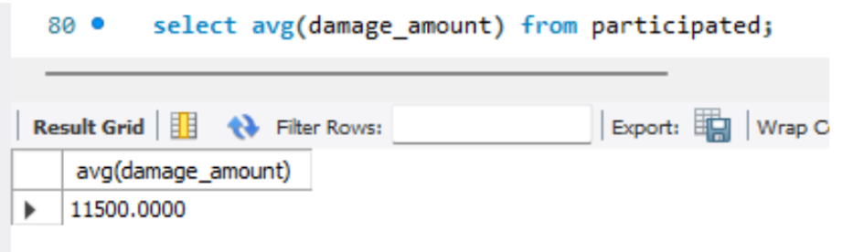
    </td>
  </tr>
</table>

<table>
  11.Delete the tuple whose damage amount is below the average damage amount.
  <tr>
    <td style="border: 4px solid gray; border-radius: 8px;">
      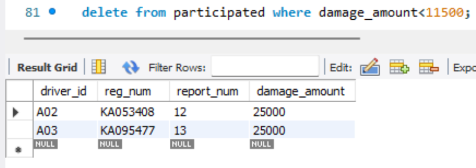
    </td>
  </tr>
</table>

<table>
  12.List the name of drivers whose damage is greater than the average damage amount.
  <tr>
    <td style="border: 4px solid gray; border-radius: 8px;">
      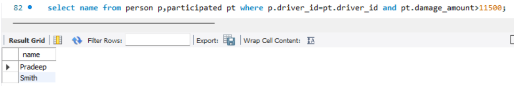
    </td>
  </tr>
</table>

<table>
  13.Find maximum damage amount.
  <tr>
    <td style="border: 4px solid gray; border-radius: 8px;">
      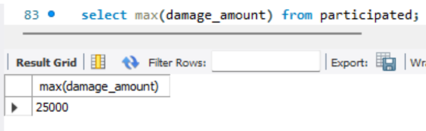
    </td>
  </tr>
</table>
